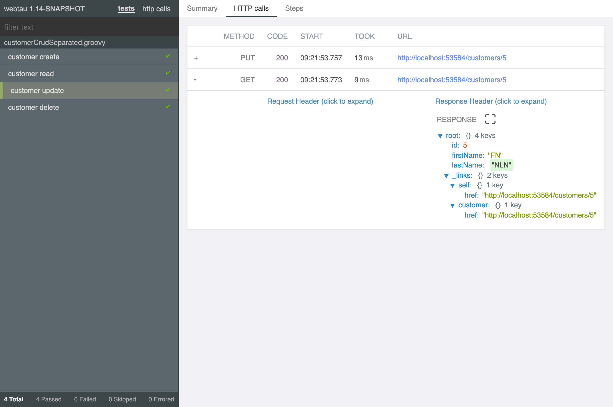

# webtau
Web Test Automation [User Guide](https://testingisdocumenting.org/webtau/)


## Simple REST tests

### JUnit 4 and JUnit 5

*Groovy*
```groovy
@RunWith(WebTauRunner.class)
class WeatherIT {
    @Test
    void checkWeather() {
        http.get("/weather") {
            temperature.shouldBe < 100
        }
    }
}
```

*Java*
```java
@RunWith(WebTauRunner.class)
public class WeatherIT {
    @Test
    public void checkWeather() {
        http.get("/weather", (header, body) -> {
            body.get("temperature").shouldBe(lessThan(100));
        });
    }
}
```

*JUnit5*
```groovy
@WebTau
class WeatherIT {
    @Test
    void checkWeather() {
        http.get("/weather") {
            temperature.shouldBe < 100
        }
    }
}
```

### Groovy command line

Support for command line friendly automation and exploration with Groovy specific simplified runner

```
webtau weather.groovy
```

```groovy
scenario("check weather") {
    http.get("/weather") {
        temperature.shouldBe < 100
    }
}
```
```json
{
  "temperature": 88
}
```

## Simple GraphQL tests

### JUnit 4 and JUnit 5

*Groovy*
```groovy
@RunWith(WebTauRunner.class)
class WeatherIT {
    @Test
    void checkWeather() {
        graphql.execute("{ weather { temperature } }") {
            weather.temperature.shouldBe < 100
        }
    }
}
```

*Java*
```java
@RunWith(WebTauRunner.class)
public class WeatherIT {
    @Test
    public void checkWeather() {
        graphql.execute("{ weather { temperature } }", (header, body) -> {
            body.get("data.weather.temperature").shouldBe(lessThan(100));
        });
    }
}
```

*JUnit5*
```groovy
@WebTau
class WeatherIT {
    @Test
    void checkWeather() {
        graphql.execute("{ weather { temperature } }") {
            weather.temperature.shouldBe < 100
        }
    }
}
```

### Groovy command line

Support for command line friendly automation and exploration with Groovy specific simplified runner

```
webtau weather.groovy
```

```groovy
scenario("check weather") {
    graphql.execute("{ weather { temperature } }") {
        weather.temperature.shouldBe < 100
    }
}
```

For single query requests, you may also omit the query name while validating the response:
```groovy
scenario("check weather") {
    graphql.execute("{ weather { temperature } }") {
        temperature.shouldBe < 100
    }
}
```

```json
{
  "data": {
    "weather": {
      "temperature": 88
    }
  }
}
```

## Robust UI tests

```groovy
scenario("search by specific query") {
    search.submit("search this")
    search.numberOfResults.should == 2
}
```

## Precise Reporting



[Full Documentation](https://testingisdocumenting.org/webtau/)
