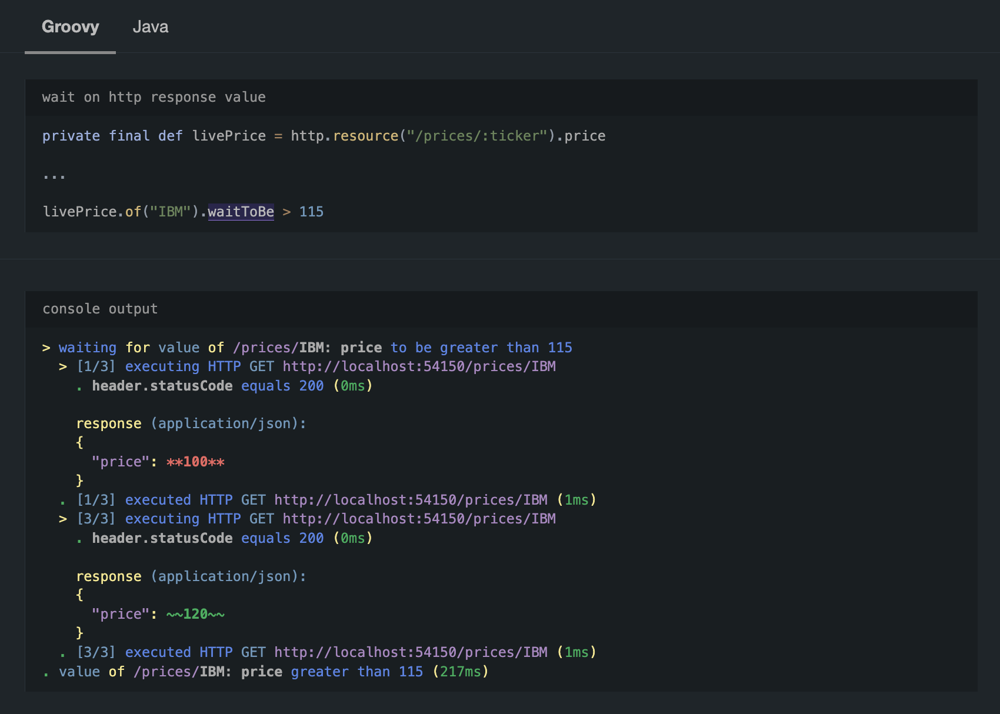
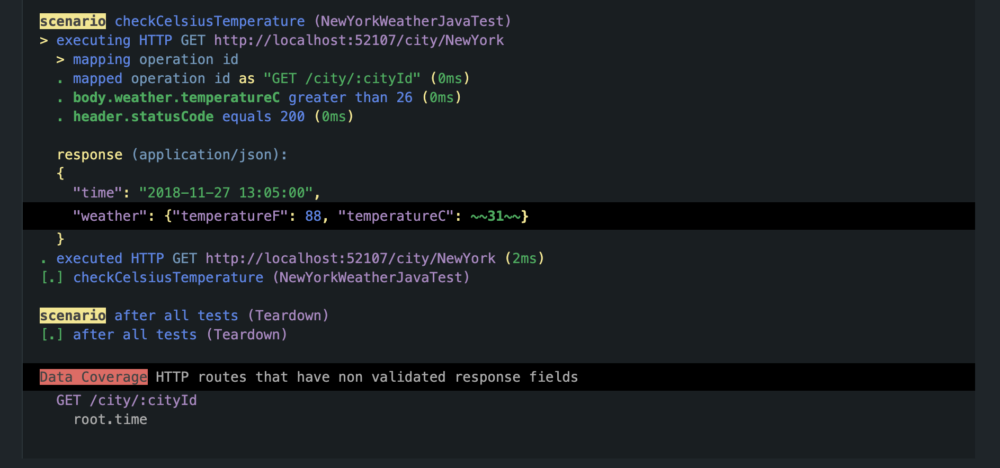
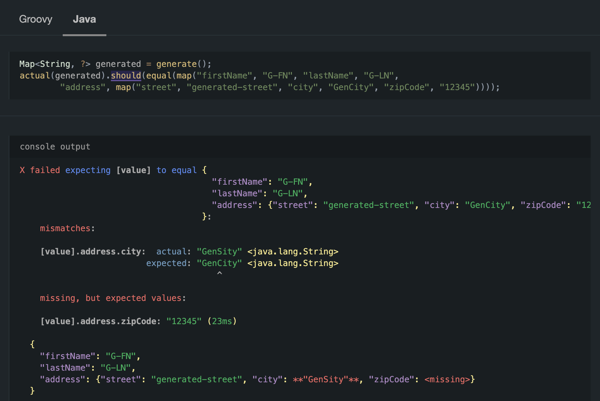
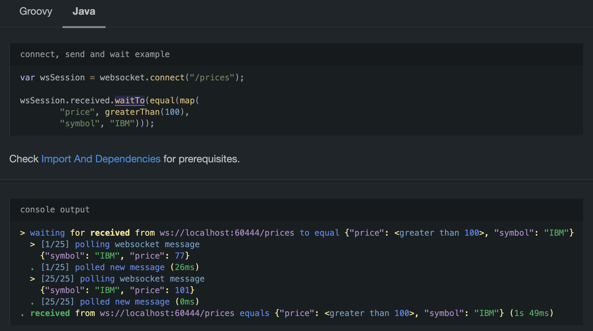
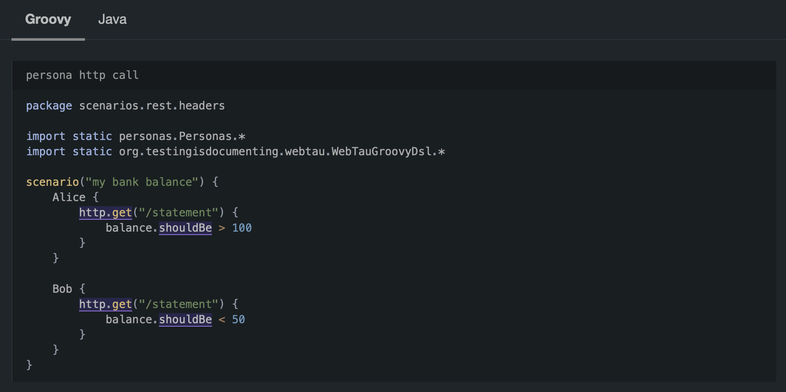
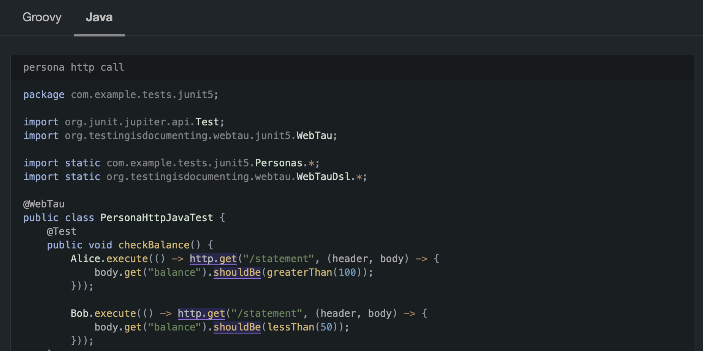

# Discord Server

Join `Testing Is Documenting` [Discord Server](https://discord.gg/aEHbzXTX6N) to ask questions and discuss features/bugs

# WebTau

Web Test Automation [User Guide](https://testingisdocumenting.org/webtau/)


WebTau (**Web** **T**est **au**tomation) - concise and expressive way to write end-to-end and unit tests.

Test your application across multiple layers and use unique features:
* [REST API with Data Coverage](https://testingisdocumenting.org/webtau/getting-started/what-is-this/#rest-api)
* [Web Socket](https://testingisdocumenting.org/webtau/getting-started/what-is-this/#websocket)
* [GraphQL API](https://testingisdocumenting.org/webtau/getting-started/what-is-this/#graphql-api)
* [Authorization Personas](https://testingisdocumenting.org/webtau/getting-started/what-is-this/#persona)
* [Browser](https://testingisdocumenting.org/webtau/getting-started/what-is-this/#browser)
* [Fake, Static And Proxy Servers](https://testingisdocumenting.org/webtau/getting-started/what-is-this/#fake-static-and-proxy-servers)
* [Database](https://testingisdocumenting.org/webtau/getting-started/what-is-this/#database)
* [CLI](https://testingisdocumenting.org/webtau/getting-started/what-is-this/#cli)
* [Business Logic (JVM only)](https://testingisdocumenting.org/webtau/getting-started/what-is-this/#business-logic-jvm)
* [REPL](https://testingisdocumenting.org/webtau/getting-started/what-is-this/#repl)
* [Reporting](https://testingisdocumenting.org/webtau/getting-started/what-is-this/#reporting)
* [Documentation Assistance](https://testingisdocumenting.org/webtau/getting-started/what-is-this/#documentation-assistance)

There are many modules, but you can use any module you need independently, or use all the modules at once with convenient single imports.

# Unique Console Output 

WebTau console output keeps you informed at all times:



[Data Coverage](https://testingisdocumenting.org/webtau/HTTP/data-coverage) output example:



# Supercharged Unit Testing Capabilities



# Testing Command Line Tools 

Testing command lines tools never been easier:

```groovy
def helloWorld = cli.runInBackground("scripts/hello-world")
helloWorld.output.waitTo contain("enter your name")

helloWorld.send("webtau\n")
helloWorld.output.waitTo contain("hello webtau")

helloWorld.stop()
```

[Learn More](https://testingisdocumenting.org/webtau/cli/foreground-command)

# WebSockets

Unbelievably simple way to wait and validate WebSocket messages:



[Learn more](https://testingisdocumenting.org/webtau/web-socket/received-messages)
 
# Personas

[Personas concept](https://testingisdocumenting.org/webtau/persona/introduction) lets you simplify Authorization Testing scenarios:





# Java, Kotlin, Groovy Scripts

Tests can be written and [executed as scripts](https://testingisdocumenting.org/webtau/groovy-standalone-runner/introduction) via command line or using [JUnit integration](https://testingisdocumenting.org/webtau/junit5/getting-started) and build systems.

*browser testing example using scripting*
```groovy
scenario("search by specific query") {
    search.submit("search this")
    search.numberOfResults.waitToBe > 1
}

$ webtau testscript.groovy
```

*browser testing example using JUnit*
```java
public class WebSearchJavaTest {
    @Test
    public void searchByQuery() {
        search.submit("search this");
        search.numberOfResults.waitToBe(greaterThan(1));
    }
}
```

# Rich Reporting

Leverage out of the box rich reporting to speed up investigation and persist testing evidences:


