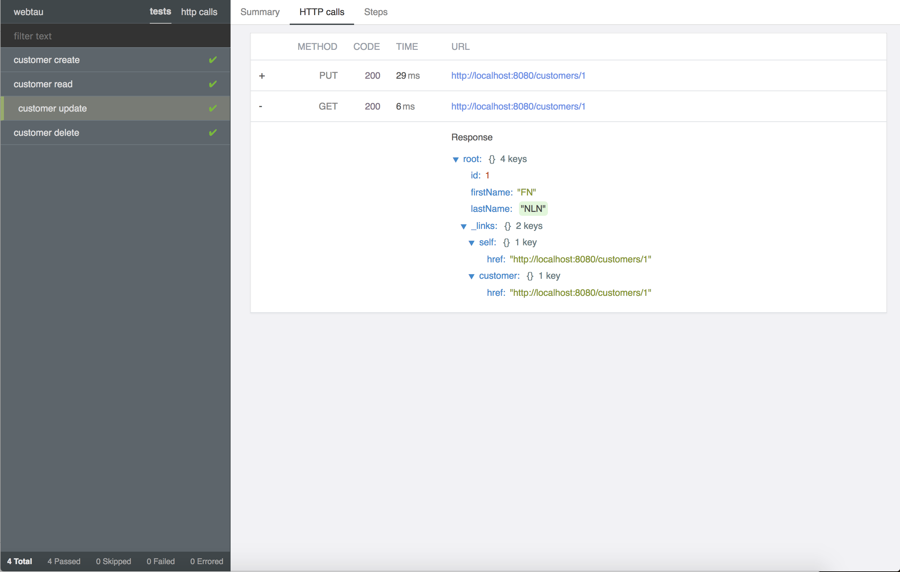

# webtau

Web Test Automation [User Guide](https://opensource.twosigma.com/webtau/guide/)


## Simple REST tests

```groovy
scenario("simple get") {
    http.get("/weather") {
        temperature.shouldBe < 100
    }
}
```
```json
{
  "temperature": 88
}
```

## Robust UI tests

```groovy
scenario("search by specific query") {
    search.submit("search this")
    search.numberOfResults.should == 2
}
```

## Precise Reporting



[Full Documentation](https://opensource.twosigma.com/webtau/guide/)
